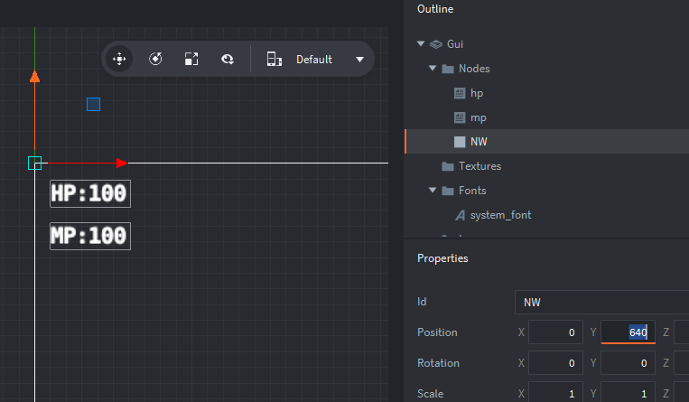
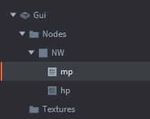
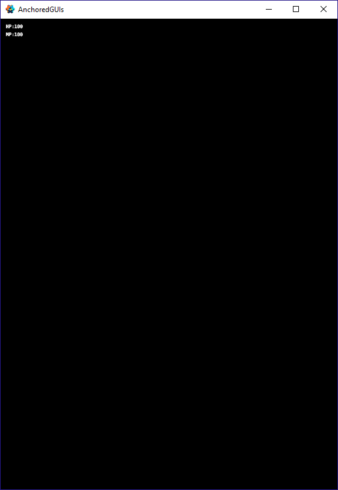

# Anchored GUIs

When you first attempt to anchor GUI elements to an area to the screen you may do it simply by setting each GUI node to have an X and Y anchor and a pivot. But if you scale the screen you may notice some issues with spacing.

As can be seen in the "Scaled Window" image above, the spacing between the nodes is inconsistent with the amount of scaling. 

The fix for this is easy!

For each area of the screen you wish to anchor nodes to, you must create a parent anchor GUI node. 

Create a box node. Set its size mode to manual, and set its size to 0,0,0. This will make it invisible.

Then set the anchor box node to have the anchor type you want. In this case X anchor left, Y anchor top.

Now you can move the box node to the area of the screen you wish to anchor other GUIs to.

Then parent the other elements to this anchor GUI. You'll need to update their positions as they will now be relative to the anchor GUI.

Now when you scale the window the GUI elements will look to be spaced more consistently.

You should generally follow this example when anchoring elements to areas of the screen as even in less extreme scaling situations the spacing can look off without this. 

Using anchor GUIs can be useful for general GUI organization as well.

